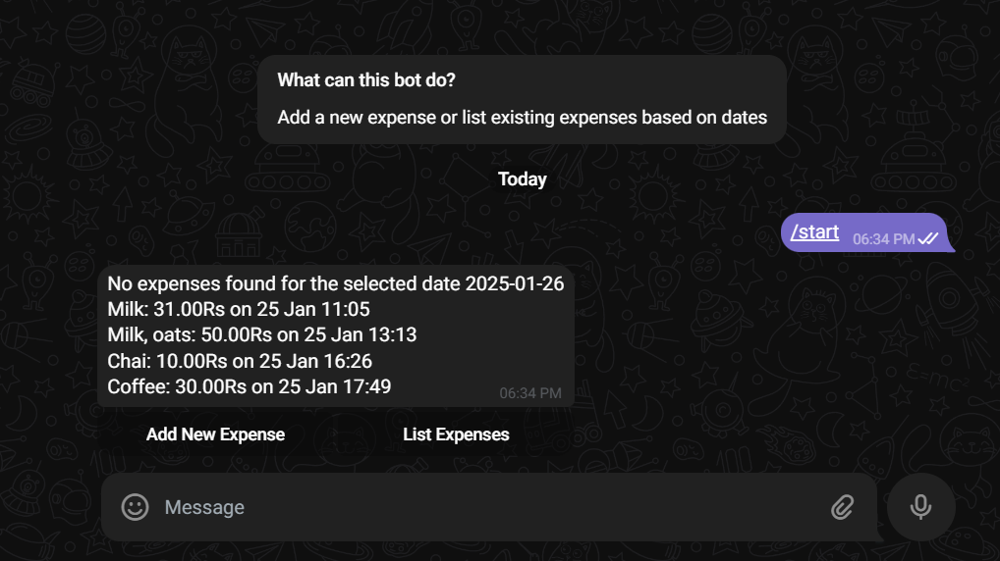

**A sophisticated Telegram bot designed to simplify personal expense management that provides an intuitive, user-friendly interface for tracking daily expenses, offering real-time insights into your spending habits.**

## Key Features
- Interactive calendar-based expense tracking
- Easy expense addition with event and price
- User-friendly Telegram interface
- Secure per-user expense management

## Technology Stack
- **Backend Framework:** Django 
- **Frontend Framework:** Python-telegram-bot
- **Database:** MySql (Clever Cloud) 
- **Deployment Platform:** Render (Dockerized Container)

## Usage
- **Start** the bot by sending /start in Telegram
- Choose **Add Expense** to enter the name and price of the expense
- Choose **list Expenses** to retrieve expenditure on multiple dates

## Gallery

- Add an Expense
---

- List multiple expenses 
---

- Handy calendar interface for easy navigation